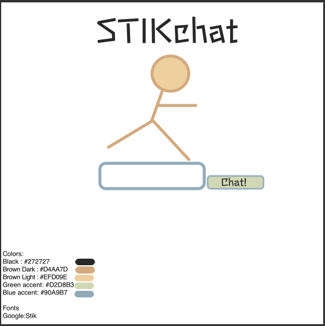
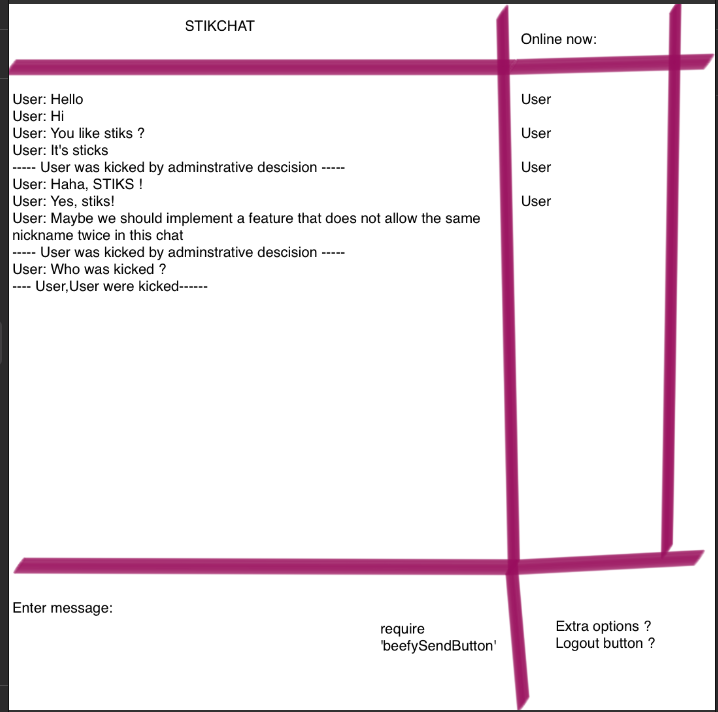

# Node JS Chatroom
This directory contains my solution to the BeCode Chatroom exercise.
A website that houses a simple chat system were users can talk to eachother.

## Exercise goals
- [x] Set up a working [NodeJS](https://nodejs.org/en/) server environment.
    - [x] Use the [NextJS](https://nextjs.org) framework
    - [x] Use the [Socket.io](https://socket.io) library
- [x] Create a basic chatroom

### Roadmap to an ultra fancy chat website
####  **Getting started**
Starting this exercise was pretty _"easy"_ since we got a nice [read me](https://github.com/becodeorg/ANT-Lamarr-6.35/tree/main/2.The-Hill/js/sockets) from our coaches that guided me towards a working chatroom.

    - Let's get this going, step 1, step 2, step 3
        - Starting over due to errors.
    - Figured out I need a different approach since I am following the same steps over and over and over...
        - Hey, I learned to program! Can I automate this ? 
        - So I spent some time writing a bash script that would execute the readme's steps for me.
        **I officialy created my first:Do My Job script** yay!.
            - Everything went pretty smooth, whenever I had an error getting trough the steps for the setup, I adapted the bash script with the solution. reran it and implemented the next step.
            - Thanks to coach Sicco I also learned a hacky way to insert text in the middle of a document using bash.... such a simple task, such a hard headache!
            - If you would like to check this script out, or maybe even run it. check out the howtodomyjob.md in this repository
            

####  **Everything works, now what ?** 

    - All right, I have a box, and a way to communicate from the client to the server, and from the server to eventually the box.
    - Now let's turn this into something nice, let's setup a plan of action. Since to implement logic, I'll need something to implement it to first.
        1. Create the frontend
            - Have a nice login/welcome page that allows the user to pick their nickname
            - Have a general overview that contains:
                - A general chat overview
                - A box to enter a new message
                - A list of connected users
        2. Make it work
            - Using some concepts of OOP store everything into objects that get communicated by the server, perhaps parse them to JSON ? 
        3. Make it nice
            - Perhaps implement roles 
            - Private chats between two users
            - Emoticon support
            - ...
#### **The Design**
Small steps climb the mountain, big steps break ankles.
1. Create a sketch on:
    - The login page
    - The chatroom
2. Get the assets
    - Fonts
    - Images

##### The Sketching
Let's draw a Stickman over the oldschool AOL logo.
find a stick font
remove the man from stickman...
Add a typo by removing the C
add chat to indicate it's a chat site.

We now have StikChat, great!

Deciding on some colors:

    - Black : #272727
    - Brown Dark : #D4AA7D
    - Brown Light : #EFD09E
    - Green accent: #D2D8B3
    - Blue accent: #90A9B7
Deciding on fonts:
    - [stick](https://fonts.google.com/specimen/Stick?query=stick)

Site info:

    - Title : StikChat
    
Create a design sketch for the home/welcome/login page

Let's sketch the basic layout for the chatroom itself, yes. I was tired of drawing. I am not a designer!

#### The HTML/CSS
I have a basic idea of the layout. So time to actually create these static pages as a codebase to work from.